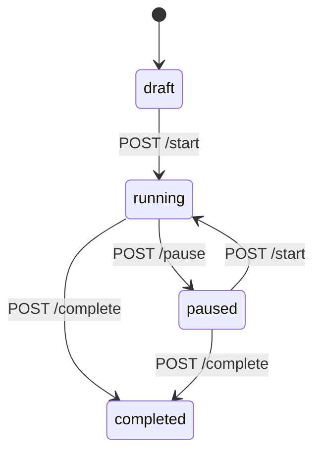

# Experiments

Experiments let you test different image variants to optimize performance. Pictify supports three experiment types: **A/B tests** for statistical comparison, **smart links** for context-based routing, and **scheduled variants** for time-based switching.

## Experiment Types

### A/B Tests

Split traffic between variants to determine which performs best. Pictify uses Thompson Sampling (multi-armed bandit) to automatically optimize traffic allocation toward winning variants.

### Smart Links

Route users to different image variants based on context: device type, geographic location, time of day, or custom rules. Smart links use nested condition trees with AND/OR logic.

### Scheduled Variants

Switch between image variants on a schedule. Supports one-time switches, daily/weekly recurrence, and cron expressions for complex schedules.

## Experiment Lifecycle

Experiments follow a strict state machine:



| Transition | Endpoint | Requirements |
|-----------|----------|-------------|
| Start | `POST /experiments/api/{uid}/start` | Status must be `draft` or `paused` |
| Pause | `POST /experiments/api/{uid}/pause` | Status must be `running` |
| Complete | `POST /experiments/api/{uid}/complete` | Status must be `running` or `paused`. Requires `winnerVariantId` |

<Warning>
Invalid state transitions return a `409 Conflict` error with the current status and allowed transitions.
</Warning>

## Variants

Each experiment has 2 or more variants. Every variant can reference a different template and set of variables.

### Weights

Variant weights use **basis points** (hundredths of a percent). All variant weights must sum to exactly **10,000**.

| Weight | Traffic Share |
|--------|--------------|
| 5000 | 50% |
| 3333 | 33.33% |
| 2500 | 25% |

```json
{
  "variants": [
    { "id": "control", "weight": 5000, "templateUid": "tmpl_abc123" },
    { "id": "variant-a", "weight": 5000, "templateUid": "tmpl_def456" }
  ]
}
```

### Smart Link Conditions

Smart link variants use condition trees with nested AND/OR logic (max depth: 3 levels):

```json
{
  "conditions": {
    "type": "group",
    "operator": "AND",
    "children": [
      {
        "type": "rule",
        "property": "device",
        "operator": "equals",
        "value": "mobile"
      },
      {
        "type": "group",
        "operator": "OR",
        "children": [
          { "type": "rule", "property": "country", "operator": "equals", "value": "US" },
          { "type": "rule", "property": "country", "operator": "equals", "value": "CA" }
        ]
      }
    ]
  }
}
```

### Scheduled Variants

Scheduled variants activate based on time:

```json
{
  "schedule": {
    "startAt": "2026-03-15T09:00:00Z",
    "endAt": "2026-03-15T17:00:00Z",
    "recurrence": {
      "type": "weekly",
      "timezone": "America/New_York"
    }
  }
}
```

Recurrence types: `none`, `daily`, `weekly`, `cron`.

## Rendering Experiments

Experiment images are served via public URLs:

```
https://api.pictify.io/s/{slug}.png
```

The server automatically selects a variant based on the experiment type:
- **A/B tests**: Thompson Sampling or equal split
- **Smart links**: First matching condition
- **Scheduled**: Currently active schedule

### Embedding

```html

```

## Event Tracking

Track impressions, views, clicks, and conversions to measure experiment performance.

```bash
curl -X POST https://api.pictify.io/s/events \
  -H "Content-Type: application/json" \
  -H "X-Write-Key: $WRITE_KEY" \
  -d '{
    "event": "impression",
    "experiment": "homepage-hero",
    "variantId": "variant-a"
  }'
```

Events can be sent individually or in batches (up to 100 per request).

| Event Type | Description |
|-----------|-------------|
| `impression` | Image was loaded/displayed |
| `view` | Image was visible in viewport (SDK only) |
| `click` | User clicked through |
| `conversion` | User completed a goal action |

### Click Tracking

Redirect users through a tracked link:

```html
<a href="https://api.pictify.io/s/homepage-hero/click">
  
</a>
```

### Tracking Pixel

Embed an invisible tracking pixel for email open tracking:

```html

```

## Goal Configuration

| Goal Type | Description |
|-----------|-------------|
| `impressions_only` | Track impressions only (default) |
| `click_through` | Track impressions and clicks with a destination URL |

For click-through goals, set a `destinationUrl` where users are redirected after clicking:

```json
{
  "goalConfig": {
    "type": "click_through",
    "destinationUrl": "https://example.com/landing"
  }
}
```

## Auto-Optimization

A/B tests can use Thompson Sampling to automatically shift traffic toward winning variants:

```json
{
  "banditConfig": {
    "enabled": true,
    "algorithm": "thompson_sampling",
    "warmupImpressions": 50,
    "recomputeIntervalMinutes": 15
  }
}
```

Auto-optimization requires the Standard plan or above.

## Plan Limits

| Plan | A/B Tests | Smart Links | Scheduled | Max Variants | Analytics Retention |
|------|-----------|-------------|-----------|-------------|-------------------|
| Starter | 1 | 0 | 0 | 2 | 7 days |
| Basic | 2 | 1 | 1 | 3 | 30 days |
| Standard | 5 | 3 | 3 | 5 | 90 days |
| Business | Unlimited | Unlimited | Unlimited | 10 | 365 days |
| Enterprise+ | Unlimited | Unlimited | Unlimited | 20 | 365 days |

Check your current quota:

```bash
curl https://api.pictify.io/experiments/api/quota \
  -H "Authorization: Bearer $API_KEY"
```

## Security Considerations

<Warning>
**Write Key vs API Token**: Your API token (`pk_live_...`) is a secret and must never be exposed client-side. The write key is designed for client-side event tracking and is safe to include in browser code.
</Warning>

- **Experiment slugs are public identifiers** visible in URLs. Do not embed sensitive information in slug names.
- **Use a write key for event tracking**. Without it, anyone who knows your experiment slug can inject events and corrupt your test data.
- **Validate destination URLs** for click-through experiments to prevent open redirect abuse.

## Best Practices

1. **Run experiments for at least 7 days** to account for day-of-week traffic variations
2. **Set a minimum sample size** before drawing conclusions (default: 1,000 impressions)
3. **Use auto-optimization** for low-traffic experiments where you want to minimize opportunity cost
4. **Track all event types** (impression + click) for complete funnel analysis
5. **Use slugs that describe the test**, not the expected outcome (e.g., `homepage-hero-test`, not `new-design-winner`)
