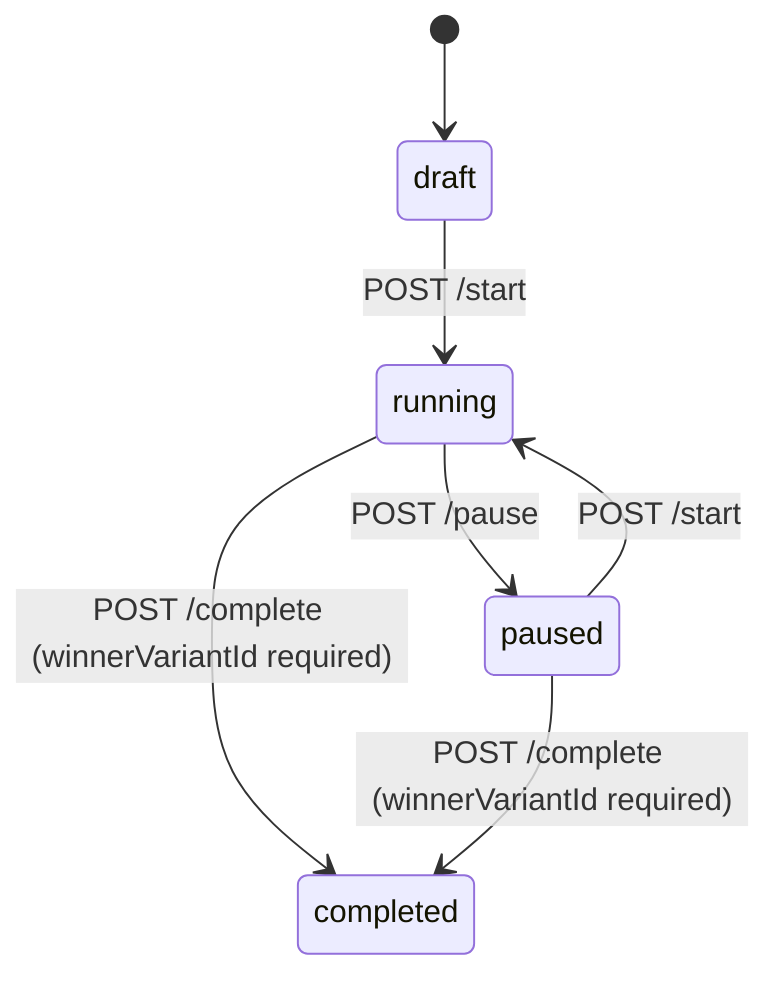

## Enhancement Summary

**Deepened on:** 2026-03-09
**Research agents used:** best-practices-researcher, framework-docs-researcher, architecture-strategist, security-sentinel, pattern-recognition-specialist, schema-explorer

### Key Improvements
1. Moved experiment tracking (events/click/pixel) from Phase 3 to Phase 1 -- they are integral to the Experiments feature
2. Added detailed security considerations for token-in-URL exposure and write key authentication
3. Added exact OpenAPI schemas extracted from the actual codebase (Experiment, Variant, Event, Quota, MultiSizeRender)
4. Added concrete `docs.json` navigation structure and Mintlify-specific implementation patterns
5. Added `X-Write-Key` as a third security scheme in OpenAPI alongside `bearerAuth` and `queryAuth`
6. Added 409 Conflict responses for state machine transitions
7. Specified exact file content patterns based on existing documentation conventions

### New Considerations Discovered
- Existing `api-reference/webhooks.mdx` documents pause/resume operations that are cookie-auth only -- needs cleanup
- Experiment slugs are public identifiers; documentation must warn against embedding sensitive data
- The `/s/events` endpoint accepts events without write key (optional auth) -- security risk that must be documented
- Multi-size render supports 24 platform presets (Instagram, Facebook, LinkedIn, etc.) worth documenting
- Plan limits vary dramatically across 15 plan tiers for experiments

---

# Audit and Add Missing API Endpoints to Documentation

## Overview

The Pictify API documentation has significant gaps compared to the actual API implementation. The most critical gap is the entire **Experiments (A/B Testing)** feature category (9 API-authenticated endpoints + public rendering + event tracking) which has zero documentation. Additionally, several endpoints are missing from existing documented categories (multi-size render, GIF get-by-uid), and the public URL rendering system (`/r/`, `/b/`, `/s/` prefixes) is completely undocumented.

## Problem Statement

Developers using the Pictify API cannot discover or use:
1. **Experiments/A/B Testing** -- an entire product feature with full API token auth support (3 experiment types, 9 CRUD+lifecycle endpoints, event tracking, public rendering)
2. **Template multi-size render** -- generate images in 24+ social media preset sizes in one API call
3. **Public URL rendering** -- embeddable image URLs for templates, bindings, and experiments
4. **GIF get-by-uid** -- basic CRUD gap
5. **Agent screenshot streaming** -- SSE-based AI screenshot generation

## Proposed Solution

Add all missing endpoints to the OpenAPI spec, create MDX documentation pages, and update `docs.json` navigation. Organize into phases by priority.

## Technical Approach

### Auth Scope Decisions (Based on Codebase Audit)

Before documenting, the following auth constraints were verified in the actual route files:

| Category | API Token Auth | Cookie Auth Only | Notes |
|----------|---------------|-----------------|-------|
| Experiments CRUD | YES (9 endpoints under `/experiments/api/`) | Also has cookie routes | Document API token routes |
| Experiment Analytics | NO | Cookie only | Omit from API ref, mention in dashboard guide |
| Experiment Duplicate | NO | Cookie only | Omit from API ref |
| Experiment Public Rendering | Public (no auth) | N/A | Document in URL Rendering section |
| Experiment Event Tracking | Write Key (`X-Write-Key`) | N/A | Document with experiments |
| Webhook pause/resume/stats | NO | Cookie only | Omit from API ref for now |
| Binding test/refresh/pause/resume | NO | Cookie only | Omit from API ref for now |
| Template search | NO | Cookie only | Omit from API ref |
| Template multi-size-render | YES | N/A | Document |
| GIF get-by-uid | Public (no auth) | N/A | Document |
| Template URL rendering `/r/` | Flexible (header or query param) | N/A | Document |
| Binding URL rendering `/b/` | Public | N/A | Document |
| Agent screenshot stream | Flexible API token | N/A | Document as MDX only (SSE) |

### Research Insights: Auth Documentation

**Add `X-Write-Key` as a third security scheme in OpenAPI:**
```yaml
components:
  securitySchemes:
    bearerAuth:
      type: http
      scheme: bearer
    queryAuth:
      type: apiKey
      in: query
      name: token
      description: API key as query parameter. Use only for  tag embedding.
    writeKeyAuth:
      type: apiKey
      in: header
      name: X-Write-Key
      description: Write key for client-side event tracking. Safe to expose in browser code.
```

**Use `security: []` to override global auth for public endpoints** (rendering, click tracking, pixel).

### Implementation Phases

#### Phase 1: Experiments (A/B Testing) -- HIGH PRIORITY

This phase covers the full Experiments feature including CRUD, lifecycle, tracking, and public rendering. Tracking endpoints (events, click, pixel) are included here because an A/B test without tracking is incomplete.

**1a. Concept page: `concepts/experiments.mdx`**

Pure prose/educational page (no `openapi` frontmatter). Must include:
- Three experiment types: `ab_test`, `smart_link`, `scheduled`
- Mermaid state machine diagram:



- Variant system: weights sum to 10000 (basis points), per-variant `templateUid` override
- Thompson Sampling for A/B tests (`banditConfig`)
- Smart link condition trees: nested AND/OR groups with rules (max depth 3)
- Scheduled variant time-based resolution with recurrence (none/daily/weekly/cron)
- Plan limits table:

| Plan | A/B Tests | Smart Links | Scheduled | Max Variants | Analytics Retention |
|------|-----------|-------------|-----------|-------------|-------------------|
| Starter | 1 | 0 | 0 | 2 | 7 days |
| Basic | 2 | 1 | 1 | 3 | 30 days |
| Standard | 5 | 3 | 3 | 5 | 90 days |
| Business | Unlimited | Unlimited | Unlimited | 10 | 365 days |
| Enterprise+ | Unlimited | Unlimited | Unlimited | 20 | 365 days |

- Security considerations section (see Security section below)
- `goalConfig` types: `impressions_only`, `click_through`
- `outputConfig`: format (png/jpeg/webp), quality

**1b. Overview page: `api-reference/experiments.mdx`**

Follow existing pattern from `api-reference/webhooks.mdx` and `api-reference/bindings.mdx`:
- Frontmatter: `openapi: get /experiments/api`
- Brief intro paragraph + link to `concepts/experiments.mdx`
- `<CodeGroup>` blocks (cURL, Node.js, Python) for each CRUD operation
- Parameter tables using `| Parameter | Type | Required | Description |` format
- Response JSON examples
- Status enum table
- Best Practices section

**IMPORTANT**: Keep the overview page thin -- do not duplicate the full request/response docs that the individual endpoint pages auto-generate from OpenAPI. The overview serves as a narrative guide linking to the endpoint pages.

**1c. Endpoint pages: `api-reference/endpoints/experiments/`**

Each file is minimal frontmatter only (this is the established Pictify convention):

```mdx
---
title: Create Experiment
openapi: post /experiments/api
---
```

Files to create:
- `create.mdx` -- `POST /experiments/api`
- `list.mdx` -- `GET /experiments/api`
- `get.mdx` -- `GET /experiments/api/{uid}`
- `update.mdx` -- `PUT /experiments/api/{uid}`
- `delete.mdx` -- `DELETE /experiments/api/{uid}`
- `start.mdx` -- `POST /experiments/api/{uid}/start`
- `pause.mdx` -- `POST /experiments/api/{uid}/pause`
- `complete.mdx` -- `POST /experiments/api/{uid}/complete`
- `quota.mdx` -- `GET /experiments/api/quota`
- `events.mdx` -- `POST /s/events` (uses `writeKeyAuth` security scheme)
- `click.mdx` -- `GET /s/{slug}/click` (uses `security: []`)
- `pixel.mdx` -- `GET /s/{slug}/pixel.gif` (uses `security: []`)

Title convention: `"{Verb} {SingularResource}"` except List uses plural. Examples:
- "Create Experiment", "List Experiments", "Get Experiment", "Start Experiment", "Track Events"

UID prefix for examples: `exp_` (matching `tmpl_`, `img_`, `gif_`, `wh_`, `bind_`)

**1d. OpenAPI spec updates for Experiments**

Add to `openapi/v1.yaml`:

**Tag:**
```yaml
- name: Experiments
  description: A/B testing, smart links, and scheduled variant experiments
```

**Schemas** (under `components/schemas`, using PascalCase, `$ref` for reuse):

`Experiment` -- Full response schema:
```yaml
Experiment:
  type: object
  properties:
    uid: { type: string, example: "exp_abc123" }
    slug: { type: string, example: "homepage-hero-test" }
    type: { type: string, enum: [ab_test, smart_link, scheduled] }
    name: { type: string, example: "Homepage Hero A/B Test" }
    status: { type: string, enum: [draft, running, paused, completed, archived] }
    templateUid: { type: string, example: "tmpl_xyz789" }
    variants:
      type: array
      items: { $ref: '#/components/schemas/ExperimentVariant' }
    goalConfig:
      type: object
      properties:
        type: { type: string, enum: [impressions_only, click_through] }
        destinationUrl: { type: string, format: uri }
    banditConfig:
      type: object
      properties:
        enabled: { type: boolean }
        algorithm: { type: string, enum: [thompson_sampling, epsilon_greedy] }
        warmupImpressions: { type: integer, default: 50 }
        recomputeIntervalMinutes: { type: integer, default: 15 }
    hypothesis: { type: string, maxLength: 500 }
    minimumSampleSize: { type: integer, default: 1000 }
    confidenceThreshold: { type: number, default: 0.95 }
    minimumRunDays: { type: integer, default: 7 }
    minimumDetectableEffect: { type: number, default: 0.05 }
    winnerVariantId: { type: string, nullable: true }
    winnerDeclaredAt: { type: string, format: date-time, nullable: true }
    fallbackImageUrl: { type: string, format: uri }
    outputConfig:
      type: object
      properties:
        format: { type: string, enum: [png, jpeg, webp], default: png }
        quality: { type: number, default: 90 }
    createdAt: { type: string, format: date-time }
    updatedAt: { type: string, format: date-time }
```

`ExperimentVariant`:
```yaml
ExperimentVariant:
  type: object
  required: [id, weight]
  properties:
    id: { type: string, pattern: "^[a-zA-Z0-9_-]+$" }
    name: { type: string }
    templateUid: { type: string }
    variables: { type: object, additionalProperties: true }
    weight: { type: integer, minimum: 0, maximum: 10000, description: "Basis points. All variant weights must sum to exactly 10000." }
    isDefault: { type: boolean, default: false }
    conditions: { $ref: '#/components/schemas/ConditionTree' }
    schedule: { $ref: '#/components/schemas/VariantSchedule' }
    impressions: { type: integer, readOnly: true }
    clicks: { type: integer, readOnly: true }
```

`ConditionTree` (for smart links):
```yaml
ConditionTree:
  type: object
  description: Nested AND/OR condition tree for smart link routing. Max depth 3.
  properties:
    type: { type: string, enum: [group, rule] }
    operator: { type: string, enum: [AND, OR] }
    children:
      type: array
      items: { $ref: '#/components/schemas/ConditionTree' }
    property: { type: string }
    value: {}
```

`VariantSchedule` (for scheduled experiments):
```yaml
VariantSchedule:
  type: object
  properties:
    startAt: { type: string, format: date-time }
    endAt: { type: string, format: date-time }
    recurrence:
      type: object
      properties:
        type: { type: string, enum: [none, daily, weekly, cron] }
        cronExpression: { type: string }
        timezone: { type: string, default: UTC }
```

`ExperimentQuota`:
```yaml
ExperimentQuota:
  type: object
  properties:
    plan: { type: string }
    quota:
      type: object
      properties:
        ab_test: { $ref: '#/components/schemas/QuotaUsage' }
        smart_link: { $ref: '#/components/schemas/QuotaUsage' }
        scheduled: { $ref: '#/components/schemas/QuotaUsage' }
    maxVariants: { type: integer }
    analyticsRetentionDays: { type: integer }

QuotaUsage:
  type: object
  properties:
    used: { type: integer }
    limit: { type: integer, nullable: true, description: "null = unlimited" }
```

`ExperimentEvent` (request body for `POST /s/events`):
```yaml
ExperimentEvent:
  type: object
  required: [event, experiment]
  properties:
    event: { type: string, enum: [impression, view, click, conversion] }
    experiment: { type: string, maxLength: 60, description: "Experiment slug" }
    variantId: { type: string }
    channel: { type: string, enum: [web, email, ad, in-app, social, other] }
    device: { type: string, enum: [mobile, desktop, tablet] }
    referrer: { type: string }
    metadata: { type: object, maxProperties: 50, description: "Max 10KB, max depth 3" }
    source: { type: string, enum: [sdk, api], default: api }
    writeKey: { type: string, description: "Alternative to X-Write-Key header" }
```

`ExperimentEventResponse`:
```yaml
ExperimentEventResponse:
  type: object
  properties:
    ok: { type: boolean }
    processed: { type: integer }
    errors:
      type: array
      items:
        type: object
        properties:
          index: { type: integer }
          error: { type: string }
    warning: { type: string, description: "Returns 'write_key_recommended' when no write key provided" }
```

**Paths to add** (9 CRUD/lifecycle + 3 tracking):

| Path | Method | OperationId | Tag |
|------|--------|-------------|-----|
| `/experiments/api` | GET | listExperiments | Experiments |
| `/experiments/api` | POST | createExperiment | Experiments |
| `/experiments/api/quota` | GET | getExperimentQuota | Experiments |
| `/experiments/api/{uid}` | GET | getExperiment | Experiments |
| `/experiments/api/{uid}` | PUT | updateExperiment | Experiments |
| `/experiments/api/{uid}` | DELETE | deleteExperiment | Experiments |
| `/experiments/api/{uid}/start` | POST | startExperiment | Experiments |
| `/experiments/api/{uid}/pause` | POST | pauseExperiment | Experiments |
| `/experiments/api/{uid}/complete` | POST | completeExperiment | Experiments |
| `/s/events` | POST | trackExperimentEvents | Experiments |
| `/s/{slug}/click` | GET | trackExperimentClick | Experiments |
| `/s/{slug}/pixel.gif` | GET | trackExperimentPixel | Experiments |

**State machine error responses:**
- Use `409 Conflict` for invalid state transitions (not 400)
- Include current state and valid transitions in error body
- Use `409 Conflict` for slug uniqueness violations

**Update validation constraints to document:**
- Draft/Paused: all fields editable
- Running: only `name`, `confidenceThreshold`, `minimumRunDays`, `goalConfig.destinationUrl`
- Completed: only `name`

**1e. Update `docs.json`**

Add to API Reference tab `groups` array, after "Batch" and before "Webhooks":
```json
{
  "group": "Experiments",
  "pages": [
    "api-reference/experiments",
    "api-reference/endpoints/experiments/list",
    "api-reference/endpoints/experiments/create",
    "api-reference/endpoints/experiments/get",
    "api-reference/endpoints/experiments/update",
    "api-reference/endpoints/experiments/delete",
    "api-reference/endpoints/experiments/start",
    "api-reference/endpoints/experiments/pause",
    "api-reference/endpoints/experiments/complete",
    "api-reference/endpoints/experiments/quota",
    "api-reference/endpoints/experiments/events",
    "api-reference/endpoints/experiments/click",
    "api-reference/endpoints/experiments/pixel"
  ]
}
```

Add to Documentation tab Concepts group:
```json
"concepts/experiments"
```

#### Phase 2: URL Rendering & Embedding -- HIGH PRIORITY

**2a. Concept page: `concepts/url-rendering.mdx`**

Must include:
- Template URL rendering: `GET /r/{templateUid}.{format}?token=xxx&var1=value1`
- Binding URL rendering: `GET /b/{bindingId}.{format}`
- Experiment URL rendering: `GET /s/{slug}.{format}`
- Auth patterns: query param `?token=` for templates, no auth for bindings/experiments
- Caching behavior: `Cache-Control` headers, `ETag` support, `304 Not Modified`
- Use cases with HTML examples: `` tags, `<meta property="og:image">`, Markdown images, email embedding
- Security warning about token-in-URL exposure (see Security section)

**Research Insights: Binary Response Documentation in OpenAPI**

For endpoints returning binary image data, use:
```yaml
responses:
  '200':
    description: Rendered image
    headers:
      Cache-Control:
        schema: { type: string, example: "public, max-age=300" }
      ETag:
        schema: { type: string }
    content:
      image/png:
        schema: { type: string, format: binary }
      image/jpeg:
        schema: { type: string, format: binary }
      image/webp:
        schema: { type: string, format: binary }
  '304':
    description: Not modified (ETag match)
  '404':
    description: Resource not found
```

**2b. Endpoint pages**

Migrate existing `api-reference/generation/template-render.mdx` to `api-reference/endpoints/url-rendering/template-render.mdx` for consistency. Create:
- `template-render.mdx` -- `GET /r/{templateUid}.{format}`
- `binding-render.mdx` -- `GET /b/{bindingId}.{format}`
- `experiment-render.mdx` -- `GET /s/{slug}.{format}`

**2c. Update `docs.json`**

Add "URL Rendering" group after Experiments in the API Reference tab:
```json
{
  "group": "URL Rendering",
  "pages": [
    "api-reference/endpoints/url-rendering/template-render",
    "api-reference/endpoints/url-rendering/binding-render",
    "api-reference/endpoints/url-rendering/experiment-render"
  ]
}
```

Add `concepts/url-rendering` to the Concepts group in the Documentation tab.

#### Phase 3: Missing Endpoints in Existing Categories -- MEDIUM PRIORITY

**3a. `api-reference/endpoints/gifs/get.mdx`** -- `GET /gif/{uid}`
- Public, no auth required (matches `GET /image/{uid}` pattern)
- Update `openapi/v1.yaml`: add `GET /gif/{uid}` with `security: []`
- OperationId: `getGif`

**3b. `api-reference/endpoints/templates/multi-size-render.mdx`** -- `POST /templates/{uid}/multi-size-render`
- API token auth required
- OperationId: `multiSizeRenderTemplate`

Multi-size render request schema:
```yaml
MultiSizeRenderRequest:
  type: object
  required: [sizes]
  properties:
    variables: { type: object, additionalProperties: true }
    sizes:
      type: array
      minItems: 1
      maxItems: 20
      items:
        type: object
        properties:
          preset: { type: string, description: "Platform preset name" }
          width: { type: integer, minimum: 10, maximum: 4096 }
          height: { type: integer, minimum: 10, maximum: 4096 }
          label: { type: string }
    format: { type: string, enum: [png, jpeg, webp], default: png }
    quality: { type: number, minimum: 0.1, maximum: 1.0, default: 0.9 }
```

Document the 24 platform presets:
- Social: `instagram-post` (1080x1080), `instagram-story` (1080x1920), `facebook-post` (1200x630), `facebook-cover` (820x312), `facebook-ad` (1200x628), `linkedin-post` (1200x627), `linkedin-cover` (1584x396), `twitter-post` (1024x512), `twitter-header` (1500x500), `pinterest-pin` (1000x1500), `youtube-thumbnail` (1280x720)
- Display Ads: `display-300x250`, `display-728x90`, `display-160x600`, `display-320x50`, `display-300x600`
- Email: `email-header` (600x200), `email-banner` (600x300)
- Other: `og-image` (1200x630)

Constraint: Max total pixel area across all sizes: 50,000,000 pixels.

**3c. `api-reference/endpoints/images/agent-screenshot-stream.mdx`** -- `POST /image/agent-screenshot-stream`
- SSE endpoint -- document in MDX only with code examples, do NOT add to OpenAPI
- Use `playground: simple` Mintlify frontmatter to disable interactive playground
- Add `<Warning>` that API playground cannot test SSE
- Document SSE event types: `connected`, `step`, `complete`, `saved`, `error`
- Include `<CodeGroup>` with cURL (using `-N` flag for streaming) and SDK examples

#### Phase 4: Guides & Tutorials -- LOW PRIORITY

1. **`guides/ab-testing.mdx`** -- End-to-end A/B testing tutorial
   - Create experiment with 2 variants (show exact request body with weights summing to 10000)
   - Start experiment
   - Embed in email/webpage using `/s/:slug.png`
   - Track events with write key
   - Check quota
   - View results and complete with winnerVariantId

2. **`guides/url-embedding.mdx`** -- How to embed dynamic images
   - Template URL rendering with variables as query params
   - Binding auto-refresh images
   - Experiment variant images
   - OG image meta tag embedding
   - Email embedding best practices

#### Phase 5: Cleanup -- LOW PRIORITY

1. **Clean up `api-reference/webhooks.mdx`** -- Remove or mark pause/resume/stats sections as "Dashboard only" since they are cookie-auth only and not available via API token
2. **Update `authentication.mdx`** -- Add write key auth documentation alongside bearer token
3. **Add `queryAuth` security scheme** to OpenAPI for template URL rendering endpoints

## Security Considerations

### CRITICAL: Token Leakage via URL Query Parameter

The template URL rendering endpoint (`/r/{templateUid}.{format}?token=xxx`) accepts API tokens as query parameters for `` tag embedding. The documentation MUST include a security warning:

- Tokens in URLs are logged in server access logs, CDN logs, and proxy logs
- Visible in browser history and can be cached
- Can leak via the `Referer` header (mitigated by server's `Referrer-Policy: no-referrer`)
- Recommendation: use header-based `Authorization: Bearer` when possible; only use `?token=` for `` tag contexts
- Consider recommending short-lived or scoped tokens for URL rendering

### HIGH: Write Key Authentication for Event Tracking

The `POST /s/events` endpoint accepts events WITHOUT a write key. Without it, anyone who knows an experiment slug can inject arbitrary events and corrupt A/B test data. Documentation must:

- Document write key as **strongly recommended** and explain data integrity risk
- Differentiate API tokens (secret, server-side only) from write keys (safe for client-side)
- Show `X-Write-Key` header as primary method, `body.writeKey` as fallback for `sendBeacon`

### HIGH: Open Redirect in Click Tracking

`GET /s/{slug}/click` redirects to `goalConfig.destinationUrl`. The server validates http/https protocol but the URL is set by the experiment owner. Documentation should:

- Note that Pictify validates destination URLs for protocol safety
- Recommend `rel="noopener noreferrer"` on click tracking links

### MEDIUM: Rate Limits for Public Endpoints

Document rate limits:
- `/s/{slug}.{format}` (rendering): 100 requests/minute per IP
- `/s/events` (event tracking): 1000 requests/minute per IP, max batch size 100 events
- `/s/{slug}/click` and `/s/{slug}/pixel.gif`: 100 requests/minute per IP

### DO NOT Document

- Internal viewer fingerprinting mechanism (SHA-256 of IP + UA)
- Context variable override query parameters (`_hour`, `_day`, `_device`, `_country`)
- Redis key naming patterns
- Cache TTL internals

## Acceptance Criteria

- [x] All 9 experiment API-token endpoints documented in OpenAPI spec and MDX pages
- [x] 3 experiment tracking endpoints (events, click, pixel) documented in OpenAPI spec and MDX
- [x] Experiment concept page with Mermaid state machine diagram, variant system, plan limits, and security considerations
- [x] URL rendering concept page covering `/r/`, `/b/`, `/s/` patterns with security warnings
- [x] 3 URL rendering endpoint pages created
- [x] `GET /gif/{uid}` added to OpenAPI spec and MDX
- [x] `POST /templates/{uid}/multi-size-render` added to OpenAPI spec and MDX with preset table
- [x] `POST /image/agent-screenshot-stream` documented in MDX with `playground: simple`
- [x] `docs.json` updated with Experiments group (13 pages) and URL Rendering group (3 pages)
- [x] `X-Write-Key` added as security scheme in OpenAPI
- [x] `queryAuth` added as security scheme in OpenAPI for URL rendering
- [x] 409 Conflict responses documented for state machine transitions
- [ ] All new OpenAPI paths pass `mintlify openapi-check`
- [x] Request/response schemas match actual API implementation
- [x] Security warnings present for token-in-URL and write key auth
- [x] Existing webhook overview page cleaned up (pause/resume marked dashboard-only)

## Key Decisions

1. **Cookie-auth-only endpoints are NOT documented in API reference** -- Bindings lifecycle (test/refresh/pause/resume), webhook lifecycle (pause/resume/stats), template search, experiment duplicate, and experiment analytics are cookie-auth only. Omit from API reference until backend adds API token support.

2. **Experiments are documented as one category with three types** -- Not three separate features. The CRUD API is shared; variants differ by type.

3. **Tracking endpoints are part of Phase 1 (Experiments)** -- Events, click tracking, and pixel are integral to A/B testing. They cannot be separated into a later phase.

4. **SSE endpoints documented in MDX only** -- `agent-screenshot-stream` uses Server-Sent Events. Use `playground: simple` Mintlify frontmatter. Do not add to OpenAPI spec.

5. **URL rendering gets its own concept page and API reference group** -- Distinct paradigm (binary responses, query-param auth, caching) that spans templates, bindings, and experiments.

6. **Variant weights use basis points (sum to 10000)** -- Must be clearly documented to prevent developer confusion.

7. **Overview pages are kept thin** -- Link to concept pages and endpoint pages rather than duplicating full request/response schemas. This avoids the anti-pattern seen in the existing bindings overview.

8. **Endpoint MDX files are frontmatter-only** -- Following the established Pictify convention. No body content; Mintlify auto-generates from OpenAPI.

9. **Use 409 Conflict for invalid state transitions** -- Not 400 Bad Request. Include current state and valid transitions in error body.

10. **Migrate `generation/template-render.mdx` to `url-rendering/`** -- Consolidates all rendering under one navigation group, eliminating the confusing `generation/` directory as a third structural convention.

## File Manifest

### New Files (Phase 1 - Experiments)
- `concepts/experiments.mdx`
- `api-reference/experiments.mdx`
- `api-reference/endpoints/experiments/create.mdx`
- `api-reference/endpoints/experiments/list.mdx`
- `api-reference/endpoints/experiments/get.mdx`
- `api-reference/endpoints/experiments/update.mdx`
- `api-reference/endpoints/experiments/delete.mdx`
- `api-reference/endpoints/experiments/start.mdx`
- `api-reference/endpoints/experiments/pause.mdx`
- `api-reference/endpoints/experiments/complete.mdx`
- `api-reference/endpoints/experiments/quota.mdx`
- `api-reference/endpoints/experiments/events.mdx`
- `api-reference/endpoints/experiments/click.mdx`
- `api-reference/endpoints/experiments/pixel.mdx`

### New Files (Phase 2 - URL Rendering)
- `concepts/url-rendering.mdx`
- `api-reference/endpoints/url-rendering/template-render.mdx`
- `api-reference/endpoints/url-rendering/binding-render.mdx`
- `api-reference/endpoints/url-rendering/experiment-render.mdx`

### New Files (Phase 3 - Missing Endpoints)
- `api-reference/endpoints/gifs/get.mdx`
- `api-reference/endpoints/templates/multi-size-render.mdx`
- `api-reference/endpoints/images/agent-screenshot-stream.mdx`

### New Files (Phase 4 - Guides)
- `guides/ab-testing.mdx`
- `guides/url-embedding.mdx`

### Modified Files
- `openapi/v1.yaml` -- Add all new endpoint paths, schemas, security schemes
- `docs.json` -- Add Experiments group (13 pages), URL Rendering group (3 pages), concept pages
- `api-reference/webhooks.mdx` -- Clean up cookie-only operations (Phase 5)
- `authentication.mdx` -- Add write key documentation (Phase 5)

## Sources & References

### Codebase References
- Experiment routes: `/Users/suyashthakur/html-to-gif/routes/experiments.js` (API token routes at lines 1099-1113)
- Experiment model: `/Users/suyashthakur/html-to-gif/models/Experiment.js`
- Experiment events: `/Users/suyashthakur/html-to-gif/routes/experiment-events.js`
- Experiment rendering: `/Users/suyashthakur/html-to-gif/routes/experiment-render.js`
- Template rendering: `/Users/suyashthakur/html-to-gif/routes/template-render.js`
- Binding rendering: `/Users/suyashthakur/html-to-gif/routes/binding-render.js`
- Plan limits: `/Users/suyashthakur/html-to-gif/config/planLimits.js`
- Canvas scaler presets: `/Users/suyashthakur/html-to-gif/service/canvas-scaler.js`
- Request context: `/Users/suyashthakur/html-to-gif/service/request-context.js`
- Event tracking: `/Users/suyashthakur/html-to-gif/service/event-tracking.js`
- Webhook routes: `/Users/suyashthakur/html-to-gif/routes/webhook-subscriptions.js`
- GIF routes: `/Users/suyashthakur/html-to-gif/routes/gif.js`
- Image routes: `/Users/suyashthakur/html-to-gif/routes/image.js`

### External References
- OpenAPI 3.1 SSE patterns: https://www.speakeasy.com/openapi/content/server-sent-events
- OpenAPI security schemes: https://www.speakeasy.com/openapi/security/security-schemes
- OpenAPI webhooks: https://bump.sh/blog/documenting-your-openapi-webhooks/
- Mintlify OpenAPI setup: https://www.mintlify.com/docs/api-playground/openapi-setup
- Mintlify MDX API config: https://www.mintlify.com/docs/api-playground/mdx/configuration
- Mintlify navigation: https://www.mintlify.com/docs/organize/navigation
- Mintlify Mermaid diagrams: https://mintlify.com/docs/components/mermaid-diagrams
- Mintlify snippets: https://mintlify.com/docs/reusable-snippets
- LaunchDarkly experimentation API patterns: https://launchdarkly.com/docs/api
- REST API best practices 2025: https://www.kulik.io/2025/04/09/rest-api-design-best-practices-and-lessons-learned/

### Existing Documentation
- Existing plan: `/Users/suyashthakur/docs-pictify/plans/feat-pictify-documentation-website.md`
