# Pictify Documentation Website

## Enhancement Summary

**Deepened on:** 2026-01-29
**Research agents used:** 10 (API best practices, SDK patterns, Mintlify framework, architecture, security, simplicity, TypeScript review, Python review, pattern recognition, agent-native review)

### Key Improvements from Research
1. **Simplified structure**: Reduced from ~70 pages to ~35 pages while maintaining comprehensive coverage
2. **Added security documentation**: Critical webhook signature verification, SSRF protection, API key best practices
3. **Added agent-native features**: MCP server, tool schemas, capabilities.json for AI integration
4. **Added missing sections**: Changelog, troubleshooting, expression engine documentation
5. **Modern framework patterns**: Updated to Next.js App Router, FastAPI lifespan, modern Python type hints

### Critical Security Gaps Addressed
- Webhook HMAC signature verification with code for all 4 SDKs
- SSRF protection documentation for URL-based rendering
- API key security best practices
- Team permission matrix

---

## Overview

Create a comprehensive, state-of-the-art documentation website for Pictify using Mintlify. The documentation will cover API reference, SDK guides for 4 languages (Node.js, Python, Go, Ruby), dashboard guides, and developer tutorials. The goal is to enable developers to quickly integrate Pictify's image, GIF, and PDF generation capabilities into their applications.

## Problem Statement / Motivation

Pictify currently lacks a centralized, well-organized documentation website. Developers need:
- Clear API reference documentation for all public endpoints
- SDK documentation with examples for Node.js, Python, Go, and Ruby
- Dashboard guides for common actions (template creation, webhook setup, etc.)
- Tutorials and best practices for common use cases

Without comprehensive documentation, developer adoption is hindered and support burden increases.

## Proposed Solution

Build a Mintlify-powered documentation site with:
- **Comprehensive API Reference**: Auto-generated from OpenAPI 3.1 spec with manual enrichment
- **SDK Documentation**: One consolidated page per SDK (not fragmented)
- **Dashboard Guides**: Consolidated visual guides for dashboard actions
- **Developer Tutorials**: Common use cases like OG image generation
- **Security Documentation**: Webhook verification, API key security, SSRF protection
- **Agent Integration**: MCP server, tool schemas for AI-native applications

## Technical Approach

### Architecture (Simplified)

```
docs-pictify/
├── docs.json                    # Mintlify configuration
├── openapi/
│   └── v1.yaml                  # OpenAPI 3.1 specification
├── introduction.mdx             # Landing page
├── quickstart.mdx               # 5-minute getting started
├── authentication.mdx           # API key setup
├── concepts/
│   ├── templates.mdx            # Template system + variables
│   ├── expressions.mdx          # Expression engine syntax (NEW)
│   ├── rendering.mdx            # Rendering options + formats
│   └── webhooks.mdx             # Webhook system
├── api-reference/
│   ├── overview.mdx             # API overview + rate limits
│   ├── generation/              # Grouped by action type
│   │   ├── images.mdx           # POST /image, /image/canvas, /image/agent-screenshot
│   │   ├── gifs.mdx             # POST /gif, /gif/capture
│   │   └── pdfs.mdx             # POST /pdf, /pdf/render, /pdf/multi-page
│   ├── templates.mdx            # All template CRUD + render
│   ├── batch.mdx                # Batch operations + status
│   ├── webhooks.mdx             # Webhook subscription CRUD
│   ├── bindings.mdx             # Bindings + data sources
│   └── errors.mdx               # RFC 9457 error catalog
├── sdks/
│   ├── overview.mdx             # SDK comparison + installation
│   ├── nodejs.mdx               # Complete Node.js/TypeScript guide
│   ├── python.mdx               # Complete Python guide (sync + async)
│   ├── go.mdx                   # Complete Go guide
│   └── ruby.mdx                 # Complete Ruby guide
├── security/                    # NEW: Critical security docs
│   ├── overview.mdx             # Security best practices hub
│   ├── webhook-verification.mdx # HMAC signature verification
│   ├── api-keys.mdx             # API key security
│   └── ssrf-protection.mdx      # URL security restrictions
├── dashboard/
│   ├── getting-started.mdx      # Overview + first template
│   ├── templates.mdx            # Complete template workflow
│   ├── settings.mdx             # API keys, webhooks, team, billing
│   └── analytics.mdx            # Usage analytics
├── guides/
│   ├── og-images.mdx            # Social media OG images (primary tutorial)
│   ├── batch-processing.mdx     # Batch rendering guide
│   └── webhook-security.mdx     # Webhook integration + security
├── agent-integration/           # NEW: AI/Agent integration
│   ├── overview.mdx             # Agent-native documentation
│   ├── mcp-server.mdx           # MCP server setup
│   ├── tool-schemas.mdx         # OpenAI/Anthropic tool formats
│   └── capabilities.json        # Machine-readable capabilities
├── resources/                   # NEW: Supporting docs
│   ├── changelog.mdx            # Version history
│   ├── troubleshooting.mdx      # Common issues + solutions
│   └── glossary.mdx             # Terminology reference
├── images/
│   └── screenshots/             # Dashboard screenshots
└── snippets/
    ├── authentication.mdx       # Auth header snippet
    ├── rate-limit-warning.mdx   # Rate limit callout
    ├── error-format.mdx         # Error response format
    └── webhook-signature.mdx    # Signature verification snippet
```

### Research Insights

#### API Documentation Best Practices (2026)

**OpenAPI 3.1 with RFC 9457 Errors:**
```yaml
openapi: 3.1.0
info:
  title: Pictify API
  version: 2.0.0
components:
  schemas:
    ProblemDetails:
      type: object
      required: [type, title, status]
      properties:
        type:
          type: string
          format: uri
          description: Link to error documentation
        title:
          type: string
        status:
          type: integer
        detail:
          type: string
        instance:
          type: string
```

**Rate Limit Headers to Document:**
| Header | Description |
|--------|-------------|
| `X-RateLimit-Limit` | Maximum requests per window |
| `X-RateLimit-Remaining` | Requests remaining |
| `X-RateLimit-Reset` | Unix timestamp when limit resets |
| `Retry-After` | Seconds to wait (on 429) |

#### Security Documentation (Critical)

**Webhook Signature Verification - All 4 SDKs:**

```typescript
// Node.js - MUST DOCUMENT
import crypto from 'crypto';

function verifyWebhookSignature(payload: string, signatureHeader: string, secret: string): boolean {
  const parts: Record<string, string> = {};
  for (const pair of signatureHeader.split(',')) {
    const [key, value] = pair.split('=');
    parts[key] = value;
  }

  const timestamp = parseInt(parts.t, 10);
  const providedSignature = parts.v1;

  // Reject if timestamp older than 5 minutes (replay protection)
  if (Math.abs(Date.now() / 1000 - timestamp) > 300) {
    throw new Error('Webhook timestamp too old');
  }

  const signedPayload = `${timestamp}.${payload}`;
  const expectedSignature = crypto
    .createHmac('sha256', secret)
    .update(signedPayload)
    .digest('hex');

  return crypto.timingSafeEqual(
    Buffer.from(providedSignature),
    Buffer.from(expectedSignature)
  );
}
```

```python
# Python - MUST DOCUMENT
import hmac
import hashlib
import time

def verify_webhook_signature(payload: bytes, signature_header: str, secret: str) -> bool:
    parts = dict(pair.split('=') for pair in signature_header.split(','))
    timestamp = int(parts['t'])
    provided_signature = parts['v1']

    if abs(time.time() - timestamp) > 300:
        raise ValueError("Webhook timestamp too old")

    signed_payload = f"{timestamp}.{payload.decode()}"
    expected_signature = hmac.new(
        secret.encode(),
        signed_payload.encode(),
        hashlib.sha256
    ).hexdigest()

    return hmac.compare_digest(provided_signature, expected_signature)
```

#### SDK Documentation Patterns

**Simplification Insight:** SDK READMEs already contain complete documentation. Do NOT fragment into multiple pages. One comprehensive page per SDK with inline framework examples.

**Modern Patterns Required:**
- Node.js: Next.js App Router (not Pages Router), Hono/Fastify examples
- Python: FastAPI lifespan pattern, Python 3.10+ type hints (`dict[str, Any]` not `Dict[str, Any]`)
- Go: Context-first parameters, `errors.As`/`errors.Is` patterns
- Ruby: Rails 7+ patterns, ActiveRecord integration

#### Agent-Native Documentation

**MCP Server Definition (NEW):**
```typescript
// @pictify/mcp-server
import { McpServer } from "@modelcontextprotocol/sdk/server/mcp.js";
import { z } from "zod";

const server = new McpServer({
  name: "pictify",
  version: "1.0.0",
});

server.tool(
  "generate_image",
  "Generate an image from HTML/CSS content",
  {
    html: z.string().describe("HTML content to render"),
    width: z.number().optional(),
    height: z.number().optional(),
    format: z.enum(["png", "jpeg", "webp"]).optional(),
  },
  async ({ html, width, height, format }) => {
    // Implementation
  }
);
```

**Capabilities JSON (for AI agents):**
```json
{
  "capabilities": [
    {
      "name": "generate_image",
      "description": "Generate an image from HTML/CSS content",
      "when_to_use": "User wants to create social cards, OG images, or convert HTML to image",
      "endpoint": "POST /v1/images",
      "required_inputs": ["html"],
      "optional_inputs": ["width", "height", "format", "quality"]
    }
  ]
}
```

### Implementation Phases (Simplified to 3)

#### Phase 1: Foundation + Core (Week 1)

**Tasks:**
- [ ] Initialize Mintlify with `docs.json`
- [ ] Create OpenAPI 3.1 spec from backend routes
- [ ] Write introduction, quickstart, authentication
- [ ] Write concepts (templates, expressions, rendering, webhooks)
- [ ] Create error catalog with RFC 9457 format
- [ ] Set up reusable snippets

**Files:**
- `docs.json`, `openapi/v1.yaml`
- `introduction.mdx`, `quickstart.mdx`, `authentication.mdx`
- `concepts/*.mdx` (4 files)
- `api-reference/errors.mdx`
- `snippets/*.mdx` (4 files)

**Success Criteria:**
- `mint dev` runs locally
- Core concepts documented
- OpenAPI validates

#### Phase 2: API + SDK Reference (Week 2)

**Tasks:**
- [ ] Document all API endpoints (grouped by action)
- [ ] Write SDK documentation (one page per SDK)
- [ ] Add security documentation (webhooks, API keys, SSRF)
- [ ] Create agent integration docs

**Files:**
- `api-reference/*.mdx` (7 files)
- `sdks/*.mdx` (5 files)
- `security/*.mdx` (4 files)
- `agent-integration/*.mdx` (3 files) + `capabilities.json`

**Success Criteria:**
- All public endpoints documented
- All 4 SDKs have complete docs
- Webhook verification documented for all languages

#### Phase 3: Guides + Launch (Week 3)

**Tasks:**
- [ ] Write dashboard guides
- [ ] Create tutorials (OG images, batch, webhooks)
- [ ] Add changelog, troubleshooting, glossary
- [ ] Configure analytics
- [ ] Deploy to production

**Files:**
- `dashboard/*.mdx` (4 files)
- `guides/*.mdx` (3 files)
- `resources/*.mdx` (3 files)

**Success Criteria:**
- Dashboard workflows documented
- Tutorials copy-paste ready
- Site deployed at docs.pictify.io

### Missing Endpoints to Add (from Architecture Review)

| Endpoint | Description | Priority |
|----------|-------------|----------|
| `POST /image/agent-screenshot` | AI-powered screenshot | HIGH |
| `POST /image/agent-screenshot-stream` | SSE streaming | MEDIUM |
| `POST /pdf/render` | Template-based PDF | HIGH |
| `POST /pdf/multi-page` | Multi-page PDF | HIGH |
| `GET /pdf/presets` | PDF preset options | MEDIUM |
| `POST /templates/upload-csv` | CSV upload for batch | MEDIUM |
| Expression validation endpoints | Expression testing | LOW |

## Acceptance Criteria

### Functional Requirements
- [ ] Documentation site loads and renders correctly
- [ ] All navigation links work
- [ ] OpenAPI spec generates API reference pages
- [ ] Code examples are syntax-highlighted
- [ ] Search functionality works
- [ ] Dark/light mode toggle works
- [ ] Mobile responsive layout

### Non-Functional Requirements
- [ ] Page load time < 2 seconds
- [ ] Lighthouse score > 90 for accessibility
- [ ] All images have alt text
- [ ] SEO metadata on all pages
- [ ] llms.txt auto-generated for AI consumption

### Security Requirements (NEW)
- [ ] Webhook signature verification documented for all 4 SDKs
- [ ] API key security best practices documented
- [ ] SSRF protection explained
- [ ] Team permission matrix documented

### Quality Gates
- [ ] All code examples tested and working
- [ ] No broken links (verified by link checker)
- [ ] Spelling and grammar reviewed
- [ ] Technical accuracy reviewed against codebase

## Success Metrics

1. **Developer Time to First API Call**: < 5 minutes from landing on docs
2. **Documentation Coverage**: 100% of public API endpoints documented
3. **SDK Coverage**: All 4 SDKs fully documented
4. **Search Effectiveness**: Users find relevant content in < 3 searches
5. **User Satisfaction**: Thumbs up rating > 80%
6. **Agent Integration**: MCP server installable via npm

## Dependencies & Prerequisites

1. **Backend API**: Stable endpoints for documentation
2. **SDK Releases**: Published packages for all 4 SDKs
3. **Dashboard Access**: For screenshot capture
4. **Mintlify Account**: For deployment and hosting
5. **Custom Domain**: docs.pictify.io configured

## Risk Analysis & Mitigation

| Risk | Impact | Probability | Mitigation |
|------|--------|-------------|------------|
| API changes during documentation | High | Medium | Version lock API spec, document version |
| SDK inconsistencies | Medium | Low | Cross-reference all SDK docs with code |
| Screenshot outdated | Low | High | Create screenshot automation script |
| OpenAPI spec errors | High | Medium | Validate with `mintlify openapi-check` |
| Security gaps in docs | High | Medium | Security review before launch |
| Code examples outdated | Medium | Medium | Automated testing of examples |

## docs.json Configuration

```json
{
  "$schema": "https://mintlify.com/docs.json",
  "name": "Pictify",
  "logo": {
    "dark": "/images/logo-dark.svg",
    "light": "/images/logo-light.svg"
  },
  "favicon": "/images/favicon.svg",
  "colors": {
    "primary": "#6366F1",
    "light": "#818CF8",
    "dark": "#4F46E5"
  },
  "navigation": {
    "tabs": [
      {
        "tab": "Documentation",
        "groups": [
          {
            "group": "Getting Started",
            "pages": ["introduction", "quickstart", "authentication"]
          },
          {
            "group": "Concepts",
            "pages": ["concepts/templates", "concepts/expressions", "concepts/rendering", "concepts/webhooks"]
          },
          {
            "group": "Security",
            "pages": ["security/overview", "security/webhook-verification", "security/api-keys", "security/ssrf-protection"]
          }
        ]
      },
      {
        "tab": "API Reference",
        "openapi": "openapi/v1.yaml",
        "groups": [
          {
            "group": "Overview",
            "pages": ["api-reference/overview", "api-reference/errors"]
          },
          {
            "group": "Generation",
            "pages": ["api-reference/generation/images", "api-reference/generation/gifs", "api-reference/generation/pdfs"]
          },
          {
            "group": "Resources",
            "pages": ["api-reference/templates", "api-reference/batch", "api-reference/webhooks", "api-reference/bindings"]
          }
        ]
      },
      {
        "tab": "SDKs",
        "groups": [
          {
            "group": "Official SDKs",
            "pages": ["sdks/overview", "sdks/nodejs", "sdks/python", "sdks/go", "sdks/ruby"]
          }
        ]
      },
      {
        "tab": "Guides",
        "groups": [
          {
            "group": "Dashboard",
            "pages": ["dashboard/getting-started", "dashboard/templates", "dashboard/settings", "dashboard/analytics"]
          },
          {
            "group": "Tutorials",
            "pages": ["guides/og-images", "guides/batch-processing", "guides/webhook-security"]
          },
          {
            "group": "AI Integration",
            "pages": ["agent-integration/overview", "agent-integration/mcp-server", "agent-integration/tool-schemas"]
          }
        ]
      }
    ],
    "anchors": [
      {
        "anchor": "API Status",
        "href": "https://status.pictify.io",
        "icon": "signal"
      },
      {
        "anchor": "Changelog",
        "href": "/resources/changelog",
        "icon": "clock-rotate-left"
      }
    ]
  },
  "api": {
    "playground": {
      "display": "interactive"
    },
    "examples": {
      "languages": ["curl", "javascript", "python", "go", "ruby"]
    },
    "mdx": {
      "auth": {
        "method": "bearer"
      }
    }
  },
  "openapi": ["openapi/v1.yaml"],
  "feedback": {
    "thumbsRating": true,
    "suggestEdit": true
  },
  "integrations": {
    "posthog": {
      "apiKey": "YOUR_POSTHOG_KEY"
    }
  }
}
```

## References & Research

### Internal References
- Backend routes: `/Users/suyashthakur/html-to-gif/routes/`
- SDK implementations: `/Users/suyashthakur/pictify-sdks/`
- Webhook signature: `/Users/suyashthakur/html-to-gif/service/webhook-delivery.js` (lines 91-143)
- SSRF protection: `/Users/suyashthakur/html-to-gif/service/ssrf-protection.js`
- Plan limits: `/Users/suyashthakur/html-to-gif/config/planLimits.js`
- Team roles: `/Users/suyashthakur/html-to-gif/models/TeamRole.js`

### External References
- Mintlify Documentation: https://mintlify.com/docs
- OpenAPI 3.1 Specification: https://spec.openapis.org/oas/v3.1.0
- RFC 9457 Problem Details: https://www.rfc-editor.org/rfc/rfc9457.html
- MCP Specification: https://modelcontextprotocol.io
- Stripe Webhooks (pattern reference): https://docs.stripe.com/webhooks

---

## ERD: Documentation Site Structure (Updated)

```mermaid
graph TD
    A[docs.json] --> B[Introduction]
    A --> C[Quickstart]
    A --> D[Authentication]
    A --> E[Concepts]
    A --> F[API Reference]
    A --> G[SDKs]
    A --> H[Security]
    A --> I[Dashboard]
    A --> J[Guides]
    A --> K[Agent Integration]
    A --> L[Resources]

    E --> E1[Templates + Variables]
    E --> E2[Expressions]
    E --> E3[Rendering]
    E --> E4[Webhooks]

    F --> F1[Overview + Rate Limits]
    F --> F2[Generation: Images/GIFs/PDFs]
    F --> F3[Templates]
    F --> F4[Batch]
    F --> F5[Webhooks API]
    F --> F6[Bindings]
    F --> F7[Errors RFC 9457]

    G --> G1[Overview]
    G --> G2[Node.js]
    G --> G3[Python]
    G --> G4[Go]
    G --> G5[Ruby]

    H --> H1[Overview]
    H --> H2[Webhook Verification]
    H --> H3[API Keys]
    H --> H4[SSRF Protection]

    I --> I1[Getting Started]
    I --> I2[Templates]
    I --> I3[Settings]
    I --> I4[Analytics]

    J --> J1[OG Images]
    J --> J2[Batch Processing]
    J --> J3[Webhook Security]

    K --> K1[Overview]
    K --> K2[MCP Server]
    K --> K3[Tool Schemas]

    L --> L1[Changelog]
    L --> L2[Troubleshooting]
    L --> L3[Glossary]
```



---

## Page Count Summary

| Section | Original | Simplified | Reason |
|---------|----------|------------|--------|
| Concepts | 5 | 4 | Merged templates + variables |
| API Reference | 18 | 7 | Grouped by action, OpenAPI handles details |
| SDKs | 25 | 5 | One page per SDK, inline framework examples |
| Security | 0 | 4 | NEW: Critical security docs |
| Dashboard | 12 | 4 | Consolidated by workflow |
| Guides | 6 | 3 | Focus on primary use cases |
| Agent Integration | 0 | 4 | NEW: AI-native features |
| Resources | 0 | 3 | NEW: Changelog, troubleshooting, glossary |
| **Total** | **~70** | **~35** | **50% reduction** |

---

## AI-Era Considerations

- **MCP Server**: Publish `@pictify/mcp-server` on npm for Claude Code, Cursor, etc.
- **Tool Schemas**: Provide OpenAI and Anthropic tool calling formats
- **Capabilities JSON**: Machine-readable API capabilities for AI agents
- **llms.txt**: Auto-generated by Mintlify for LLM consumption
- **System Prompt Snippet**: Recommended prompt text for AI apps using Pictify
- **Error Catalog**: Machine-readable with recovery actions for AI error handling
